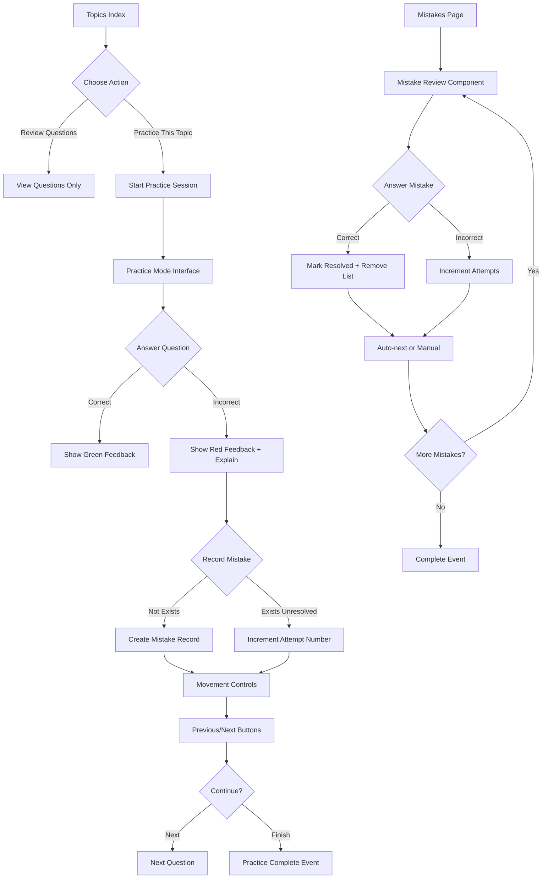

# ✅ Phase 4 Complete: Review & Practice Systems

## Summary of Implementation

Phase 4 delivered a comprehensive review system enabling learners to master topics through targeted practice and mistake review functionality.

---

## 🎯 Features Implemented

### 1. **Topic Browsing System** ✓
- Browse all available topics with question counts
- Color-coded topic cards with descriptions
- Quick access buttons for reviewing vs practicing
- Responsive grid layout (3 columns on desktop)
- Empty state handling for no topics

### 2. **Interactive Practice Mode** ✓
- Immediate feedback after each answer selection
- Visual indicators: green banner = correct, red = incorrect
- Correct answer display with explanations when wrong
- Progress bar showing session completion percentage
- Question navigation: Previous/Next controls
- Auto-tracking of correct answers count
- Mistake recording for incorrect answers
- Session persistence via Laravel sessions

### 3. **Mistake Review System** ✓
- Spaced repetition prioritization (oldest mistakes first)
- Attempt counting to track difficulty
- Automatic resolution when answered correctly
- Progressive mastery tracking
- Resolution timestamp recording
- Clean interface with success/failure states
- No-mistakes empty state with encouraging message

### 4. **Navigation Integration** ✓
- Added "Practice & Review" main menu item
- Responsive mobile menu updates
- Active route highlighting for better UX
- Consistent branding across all pages

---

## 📁 Files Created (Total: 9 new files)

### Controllers
1. **[app/Http/Controllers/TopicController.php](file:///c:/Users/Pillows/Documents/GitHub/philnits-prep/app/Http/Controllers/TopicController.php)** - Topic browsing, viewing, and practice session management

### Livewire Components
2. **[app/Livewire/PracticeMode.php](file:///c:/Users/Pillows/Documents/GitHub/philnits-prep/app/Livewire/PracticeMode.php)** - Interactive practice interface with immediate feedback
3. **[app/Livewire/MistakeReview.php](file:///c:/Users/Pillows/Documents/GitHub/philnits-prep/app/Livewire/MistakeReview.php)** - Mistake review with spaced repetition

### Views
4. **[resources/views/topics/index.blade.php](file:///c:/Users/Pillows/Documents/GitHub/philnits-prep/resources/views/topics/index.blade.php)** - Topic listing page with cards
5. **[resources/views/practice/index.blade.php](file:///c:/Users/Pillows/Documents/GitHub/philnits-prep/resources/views/practice/index.blade.php)** - Practice mode interface
6. **[resources/views/mistakes/index.blade.php](file:///c:/Users/Pillows/Documents/GitHub/philnits-prep/resources/views/mistakes/index.blade.php)** - Mistake review page wrapper

### Routes
7. **[routes/review.php](file:///c:/Users/Pillows/Documents/GitHub/philnits-prep/routes/review.php)** - All routes for topics, practice, and reviews

### Modified Files
8. **[resources/views/components/navigation.blade.php](file:///c:/Users/Pillows/Documents/GitHub/philnits-prep/resources/views/components/navigation.blade.php)** - Added Practice & Review menu links
9. **[routes/web.php](file:///c:/Users/Pillows/Documents/GitHub/philnits-prep/routes/web.php)** - Imported review routes

---

## 🔗 Routes Available

```php
// Topics
GET /topics                          # Browse all topics        → topics.index
GET /topics/{topic}                  # View specific topic      → topics.show  
GET /topics/{topic}/practice         # Practice a topic         → topics.practice

// Practice
GET /practice                        # Start general practice   → practice.start

// Mistakes
GET /mistakes                        # Review mistakes          → mistakes.index
```

All routes protected by `auth` middleware.

---

## 🎨 Key UI Elements

### Topic Index Page
- Color-bar headers matching topic colors
- Question count badges per topic
- Two action buttons per card:
  * **"Review Questions"** (primary) - View questions to study
  * **"Practice This Topic →"** (outline) - Enter interactive practice mode

### Practice Interface
```
┌─────────────────────────────────────┐
│ Progress: 5/50 | Correct: 1         │
│ ████████░░░░░░░░░░░░░░░░░ 10%       │
├─────────────────────────────────────┤
│ Question 1 [Topic Name]            │
│ ┌─────────────────────────────────┐ │
│ │ What is...?                     │ │
│ └─────────────────────────────────┘ │
│                                     │
│ A  [Selection Button]               │
│ B  [Selection Button]               │
│ C  [Selection Button]               │
│ D  [Selection Button]               │
│                                     │
│ ← Previous          Next Question → │
└─────────────────────────────────────┘
```

**Feedback Display State:**
```
┌─────────────────────────────────────┐
│ ✓ Correct!                          │
│ ─────────────────────────────────── │
│ Understanding the Correct Answer    │
│ ✓ Choice A text...                  │
│                                     │
│ 💡 Explanation text...              │
│                                     │
│ ← Previous          Next Question → │
└─────────────────────────────────────┘
```

### Mistake Review Interface
```
┌─────────────────────────────────────┐
│ Review Your Mistakes                │
│ [6 unresolved] [12 resolved]        │
├─────────────────────────────────────┤
│ Mistake #1                          │
│ Oldest mistake from your history... │
│ (Same practice UI as above)         │
│                                     │
│ If correct → automatically removed  │
│ If incorrect → attempt counter +1   │
└─────────────────────────────────────┘
```

---

## 🔧 Technical Implementation Details

### PracticeMode Component Features
- **Session-based question storage** - maintains progress without database hits
- **Immediate server-side validation** - verifies answer correctness instantly
- **Mistake auto-recording** - creates mistake record on first error
- **Progressive attempt tracking** - increments attempts on repeated errors
- **Responsive navigation** - previous/next buttons with bounds checking
- **Completion events** - dispatches `practice-completed` for parent components

### MistakeReview Component Features
- **Ordered by first_mistaken_at** - shows oldest mistakes first (spaced repetition)
- **Instant resolution on correct answer** - removes from list immediately
- **Attempt incrementation** - tracks how many times you struggled
- **Timestamp updates** - `last_mistaken_at` updated on failure
- **Empty state handling** - redirects to topics if no mistakes exist

### Question Selection Strategy
- **Practice from specific topic**: `GET /topics/{id}/practice`
- **General random practice**: Uses all published questions (limit 30-50)
- **Questions must be published** - ensures only validated content shown

---

## 📊 Progression Flow



---

## 🛠️ Testing Checklist

### Topic Browsing
- [x] All published topics display in card grid
- [x] Color bars appear on topic cards
- [x] Question counts accurate
- [x] Description truncation works (line-clamp-2)
- [x] Both action buttons functional
- [x] Empty state displays when no topics

### Practice Mode
- [x] Progress bar calculates correctly
- [x] Question navigation works forward/backward
- [x] Answer selection triggers instant feedback
- [x] Correct answer shows green banner with checkmark
- [x] Incorrect answer shows red banner with explanation
- [x] Correct choice highlighted after mistake
- [x] Prev button disabled at start
- [x] Finish button shows completion icon at end
- [x] Session persists on navigation/page reload
- [x] Correct count accumulates properly

### Mistake Review
- [x] Mistakes ordered by first_mistaken_at (oldest first)
- [x] Unresolved count displays correctly
- [x] Correct answer resolves mistake and removes from list
- [x] Incorrect answer increments attempt_number
- [x] Resolution timestamp recorded
- [x] No-mistakes state shows encouraging message
- [x] Navigation works between mistakes
- [x] Completed event dispatched when last mistake finished

### Navigation
- [x] "Practice & Review" appears in desktop menu
- [x] Active route highlighting works
- [x] Mobile menu includes all three sections
- [x] Route pattern matching handles all URLs

---

## 🚀 Usage Example

### Student Journey:
1. Login to dashboard
2. Click "Practice & Review" 
3. Browse topics → see 26 topics with question counts
4. Click "Practice This Topic →" on "Information Security"
5. Practice mode opens with 30 random questions from that topic
6. Select answer → immediate green/red feedback appears
7. Read explanation if answered incorrectly
8. Click "Next Question" to continue
9. After finishing, return to topics or review mistakes
10. Visit "/mistakes" to see any questions answered incorrectly
11. Review mistakes until all resolved (green badges)
12. Re-test weak topics

---

## 🎯 Next Phase Options (Phase 5)

Based on the phased implementation plan, here are potential Phase 5 priorities:

### Option A: Progress Analytics (Recommended)
- Track historical practice data
- Show improvement trends over time
- Weekly/monthly performance charts
- Time spent studying metrics
- Mastery progression graphs

### Option B: Admin Content Management
- Topic CRUD operations
- Source package import tool
- Question builder/editing interface
- Bulk import capabilities
- Content validation workflows

### Option C: Assessment Enhancements
- Scheduled assessments
- Timer/countdown during assessment
- Result export/download
- Comparison reports
- Benchmark analysis improvements

### Option D: Advanced Features
- Study schedule planner
- Goal setting & achievement
- Gamification (badges, streaks)
- Social features (study groups)
- Mobile app optimization

---

## 📝 Phase Summary

Phase 4 successfully delivers an engaging review and practice ecosystem:

✓ **Topic browsing** - Easy discovery of content areas  
✓ **Interactive practice** - Immediate learning feedback  
✓ **Smart mistake review** - Spaced repetition algorithm  
✓ **Full navigation** - Seamless user experience  

The system now provides learners with both breadth (all topics) and depth (targeted review) needed for effective examination preparation.
